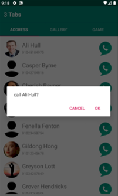
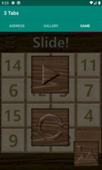

  
# 3-Tabs
An android app with 3 tabs

3개의 탭으로 이루어진 안드로이드 앱

## What is it?
This app is developed as the first-week task of 2019 winter madcamp.
The three tabs each consist of an address book, an image gallery, and a simple 15-puzzle game.

2019년 겨울 몰입캠프 1주차 과제로 제작한 안드로이드 어플리케이션입니다.
세 탭은 각각 주소록, 이미지 갤러리, 그리고 15-퍼즐(슬라이드 퍼즐) 게임으로 이루어져 있습니다.

## Used
* Tab 1 written in Kotlin, others written in Java
* Developed in Android Studio 3.5.3
* Android platform version: API 29: Android 10.0 (Q) revision 4

## Tab 1: Address Book

The first tab is an address book(implemented with RecyclerView).
On activity start, the application reads names, phone numbers, and profile photos from the device.
The user can make phone calls by touching the call button.

첫 번째 탭은 RecyclerView를 이용해 구현한 주소록입니다.
Activity start 시점에 기기에서 이름, 전화번호, 프로필 사진을 가져와 표시해주며, 통화 버튼을 누르면 전화를 걸 수도 있습니다.

## Tab 2: Image Gallery

The second tab is an image gallery(implemented with TableLayout).
On long click, the application brings an image from the device.
On short click, the application shows the clicked image in full screen.
The user can see previous/next image by swiping left or right(implemented using ViewPager).

두 번째 탭은 TableLayout을 이용해 구현한 이미지 갤러리입니다.
사진 칸을 길게 누르면 기기에서 원하는 사진을 가져올 수 있고, 짧게 누르면 누른 사진을 확대해서 볼 수 있습니다.
확대된 사진을 옆으로 넘겨 이전/다음 사진을 볼 수도 있습니다(ViewPager를 이용해 구현).

## Tab 3: 15-Puzzle

The third tab is a 15-puzzle(a.k.a. slide puzzle).
The goal of the game is to sort the blocks in order.
The user can move the blocks by swiping up/down/left/right.
When the blocks are sorted (i.e. the game is cleared), a toast message "Hooray!" shows up and a "Hooray" sound is played.
The user can play the game with an image from the device by touching the 'image' button in the pause screen.

세 번째 탭은 15-퍼즐(슬라이드 퍼즐) 게임으로, 블럭을 움직여 순서대로 정돈하는 게임입니다.
화면을 상하좌우로 스와이프해 블럭을 빈 공간으로 움직일 수 있으며, 게임을 클리어하면 "Hooray!"라는 토스트 메시지와 함께 "Hooray!"하고 외치는 소리가 나옵니다.
일시정지 메뉴에서 '사진' 버튼을 터치하면 갤러리에서 가져온 사진으로 게임을 플레이할 수도 있습니다.
